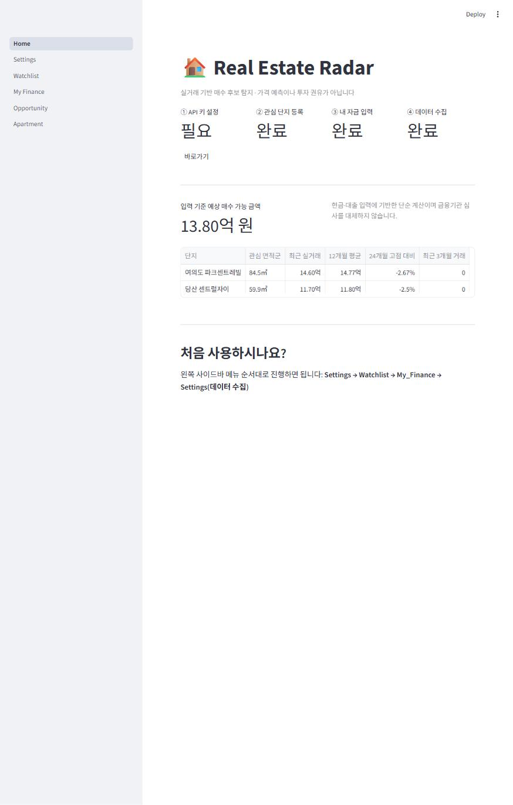
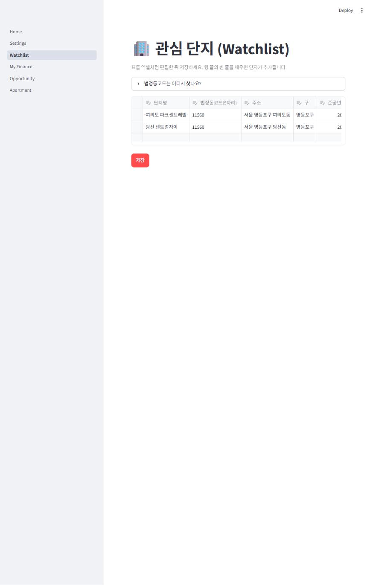
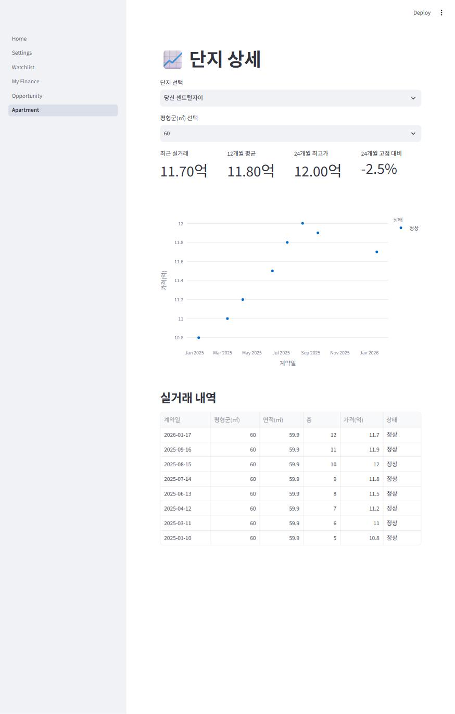

# Real Estate Radar


여의도 출퇴근권 관심 단지의 국토교통부 아파트 매매 실거래를 모으고, 가격·거래량 지표와 사용자 매수 가능 금액을 한 화면에서 비교하는 개인용 의사결정 지원 도구입니다. 가격 상승을 예측하거나 매수 결정을 자동화하지 않습니다.

## 화면

| Home | Watchlist | Apartment 상세 |
| --- | --- | --- |
|  |  |  |

*(스크린샷은 예시로 만든 가상의 단지·가격 데이터입니다. 실제 서비스 데이터가 아닙니다.)*

## 빠른 시작 (터미널 없이)

`run.bat` 파일을 더블클릭하면 됩니다. 처음 실행 시 가상환경 생성과 패키지 설치가 자동으로 이루어지고, 이후에는 바로 브라우저가 열립니다.

브라우저가 열리면 왼쪽 메뉴 순서대로 진행하세요:

1. **Settings** — 국토교통부 공공데이터포털 서비스키를 발급받아 붙여넣고 저장 (화면에 발급 방법 안내가 있습니다)
2. **Watchlist** — 표를 엑셀처럼 편집해 관심 단지를 등록 (법정동코드 찾는 법 링크 포함)
3. **My Finance** — 본인 자금 정보 입력 (만 원 단위, 이 컴퓨터에만 저장됨)
4. **Settings** 화면 하단의 "데이터 수집 시작" 버튼 클릭 → 실거래 수집

파일을 직접 편집할 필요가 없습니다.

## 개발자용 (터미널)

```powershell
py -3.12 -m venv .venv
.\.venv\Scripts\Activate.ps1
pip install -r requirements.txt
Copy-Item .env.example .env
python scripts/init_db.py
streamlit run dashboard/Home.py
```

CLI로 수집하려면 `python scripts/collect_transactions.py --months 24`를 실행합니다 (Settings 화면의 "데이터 수집 시작"과 동일한 로직입니다). 데이터는 SQLite `data/real_estate.db`에 저장됩니다.

## 데이터와 설정

- 국토교통부 아파트 매매 실거래가 OpenAPI (XML) 사용
- API 서비스키는 `.env`에 저장하며 Git에 포함하지 않습니다.
- `legal_dong_code`는 법정동 코드 앞 5자리, `year_month`는 `YYYYMM` 형식입니다.
- 실거래 신고 지연·정정 및 취소 가능성이 있어 최근 월은 반복 수집할 수 있습니다. 취소 건은 삭제하지 않고 상태로 보존합니다.
- 금융 수치는 `data/user_finance.json`에서 관리하며 초기값은 모두 0입니다.

## 주의

매수 가능 금액은 사용자가 입력한 자금에서 비상자금을 제외한 단순 참고 계산이며, 대출 심사·세금·중개보수 판단을 대체하지 않습니다. API 이용약관과 정책을 준수하세요. 호가 사이트 무단 크롤링은 포함하지 않습니다.
